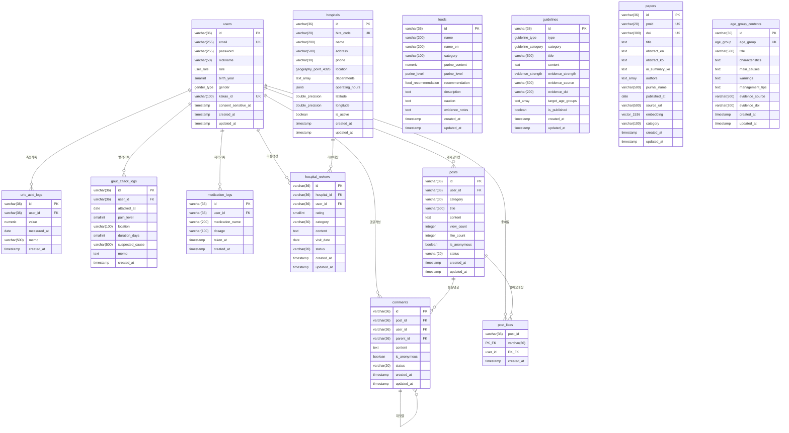

# Gout Care — ERD (2026-04-24)

> 출처: `gout-back/src/main/resources/db/migration/V1`~`V17` 및 실제 JPA 엔티티.
> Mermaid `erDiagram` 으로 작성. 시드 데이터 마이그레이션(V10, V11, V13~V17)은
> 스키마 변경이 없으므로 제외.

---

## Mermaid ERD

---

## 엔티티 별 메모

### users (V2)
- PK: `id VARCHAR(36)` — `gen_random_uuid()::text` 기본값. JPA 에선 `@GeneratedValue(UUID)`.
- `role user_role NOT NULL DEFAULT 'USER'` — USER / ADMIN.
- `gender gender_type` — PG enum. **Hibernate JPA 매핑이 VARCHAR 로 나가서 INSERT 실패**. NEXT_STEPS §1.1.
- `email` UNIQUE, `kakao_id` UNIQUE.
- Soft-delete 컬럼은 없음 — 현재 논리 삭제 미지원.

### 건강기록 3종 (V3)
- `uric_acid_logs`, `gout_attack_logs`, `medication_logs` 모두 `user_id` ON DELETE CASCADE.
- **민감정보** (요산 수치, 발작) — `users.consent_sensitive_at` 가 null 이어도 현재 생성 가능. 동의 체크 로직은 서비스단에 미구현.
- `updated_at` 컬럼 없음 (BaseEntity 미상속, 직접 `@Column created_at` 정의).

### hospitals + hospital_reviews (V4, V12)
- PostGIS `location geography(Point, 4326)` + GIST 인덱스로 반경 검색.
- V12 에서 `latitude`/`longitude` DOUBLE PRECISION 추가 — Hibernate 매핑용. **컬럼 중복** (location 과 lat/lng 둘 다 존재).
- `hospital_reviews.category` 는 원래 enum 이었으나 Hibernate 7.2 NPE 로 VARCHAR + CHECK 제약으로 단순화.
- `UNIQUE(user_id, hospital_id, visit_date)` — 같은 날 중복 리뷰 방지.
- `departments text[]`, `operating_hours jsonb`.

### foods (V5)
- PG enum 2개: `purine_level`, `food_recommendation`.
- `idx_foods_name_trgm GIN(name gin_trgm_ops)` — 한글 부분문자열 검색 용. 현재 JPQL LIKE 는 trgm 인덱스 활용 못함.

### guidelines (V6)
- PG enum 3개: `guideline_type`, `guideline_category`, `evidence_strength`.
- `target_age_groups text[]` + GIN 인덱스 — 연령별 필터 가능하나 현재 API 미노출.
- `evidence_doi` — 근거 DOI 링크.

### papers (V7)
- `embedding vector(1536)` — pgvector. OpenAI `text-embedding-3-small` 기준.
- `idx_papers_embedding ivfflat (embedding vector_cosine_ops) WITH (lists = 100)` — 코사인 유사도 인덱스.
- `pmid`, `doi` UNIQUE (null 허용).

### posts + comments + post_likes (V8)
- `posts.category` / `posts.status` / `comments.status` — PG enum 대신 VARCHAR+CHECK 로 전환 (Hibernate 7.2 호환 문제로).
- `comments.parent_id` self-FK — 대댓글. 깊이 제한은 없음 (§2.6 참고).
- `post_likes` 는 **composite PK `(post_id, user_id)`** — 중복 좋아요 DB 차원에서 차단.

### age_group_contents (V9)
- `age_group age_group NOT NULL` — PG enum. 연령대별 유니크 인덱스 (`idx_age_group_contents_age UNIQUE`).
- 현재 V16 시드로 6건 완전 채워짐.

---

## 외래키 요약

| 자식 | 부모 | ON DELETE |
|------|------|-----------|
| uric_acid_logs.user_id | users.id | CASCADE |
| gout_attack_logs.user_id | users.id | CASCADE |
| medication_logs.user_id | users.id | CASCADE |
| hospital_reviews.hospital_id | hospitals.id | CASCADE |
| hospital_reviews.user_id | users.id | CASCADE |
| posts.user_id | users.id | CASCADE |
| comments.post_id | posts.id | CASCADE |
| comments.user_id | users.id | CASCADE |
| comments.parent_id | comments.id | CASCADE |
| post_likes.post_id | posts.id | CASCADE |
| post_likes.user_id | users.id | CASCADE |

- `papers`, `foods`, `guidelines`, `age_group_contents` 는 **FK 없음** — 마스터/콘텐츠 엔티티.
- `hospitals` 는 FK 가 없고 `hospital_reviews` 에서만 참조받음.

---

## 인덱스 핵심

- `users(email)`, `users(kakao_id)` — 로그인/소셜 로그인 lookup.
- `hospitals USING GIST(location)` — 반경 검색.
- `hospitals USING GIN(name gin_trgm_ops)` — 한글 부분문자열.
- `foods USING GIN(name gin_trgm_ops)` — 위와 동일.
- `papers USING ivfflat(embedding vector_cosine_ops)` — pgvector KNN.
- `posts(created_at DESC)` — 목록 최신순.
- `hospital_reviews UNIQUE(user_id, hospital_id, visit_date)` — 중복 방지.
